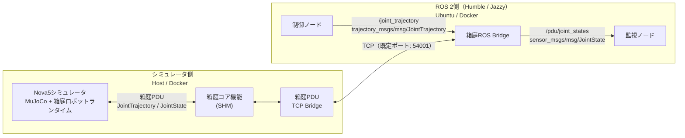
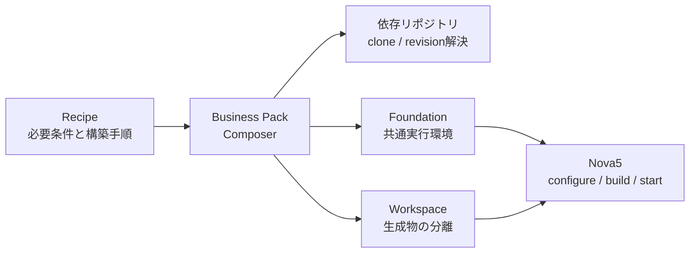

# hakoniwa-robot-arm

`hakoniwa-robot-arm` は、URDF / Xacro で記述されたROSロボットモデルをもとに、箱庭上でロボットアームシミュレータを構築・実行するためのシミュレーション開発基盤です。

ロボットモデルをMuJoCo形式へ変換し、[箱庭ロボットランタイム](https://github.com/hakoniwalab/hakoniwa-robot-runtime)と組み合わせることで、実機を使用せずに関節制御や状態取得を行えます。また、ROS 2からの `JointTrajectory` による制御と `JointState` の取得にも対応しています。

現在のサポート状況：

- DOBOT Nova5

## できること

- URDF / Xacroで記述されたロボットモデルをMuJoCo形式へ変換
- MuJoCoによるロボットアームの物理シミュレーション
- 箱庭ロボットランタイムによる関節制御
- ROS 2 `JointTrajectory` による関節軌道制御
- ROS 2 `JointState` による関節状態の取得
- Dockerを利用したROS 2実行環境
- Host上のMuJoCo Viewerを利用したシミュレーション可視化

## アーキテクチャ

シミュレータ側とROS 2側をTCPで分離し、ROS 2標準メッセージを用いてロボットアームを制御・観測します。ROSトピックはROS 2側で終端し、シミュレータ側では箱庭PDUとして箱庭コアの共有メモリ（SHM）へ入出力します。



### シミュレータの構成

シミュレータ側では、MuJoCoと箱庭ロボットランタイムがロボット定義を読み込み、物理シミュレーション、制御入力の受付、関節状態の出力を行います。箱庭PDU TCP Bridgeは、SHM上の箱庭PDUをROS 2側とのTCP通信へ中継します。MuJoCo Viewerを表示する実行と、Viewerを使用しないheadless実行を選択できます。

### ROS 2側の構成

箱庭ROS Bridgeが、TCP上の箱庭PDUとROS 2標準メッセージを相互変換します。制御には `trajectory_msgs/msg/JointTrajectory`、状態取得には `sensor_msgs/msg/JointState` を使用します。シミュレータとROS 2をTCPで分離しているため、それぞれの実行環境を独立して構築できます。

### 箱庭ロボットランタイム

箱庭ロボットランタイムは、ロボットごとの挙動や通信構成を定義ファイルから組み立てる共通基盤です。主に以下を入力として、物理モデル、制御入力、状態出力、通信経路を構成します。

- 箱庭アセットマニフェスト
- MuJoCoモデル（MJCF）
- PDU定義とPDU通信定義
- アクチュエータ、コントローラ、センサ設定

## 箱庭Business Packとの関係

[hakoniwa-business-pack](https://github.com/hakoniwalab/hakoniwa-business-pack)は、箱庭シミュレーションに必要な依存関係、共通実行環境、ビルド手順を管理するComposerです。本リポジトリはロボット固有のモデル、設定、アプリケーションを提供し、環境の構築と分離にはBusiness PackのWorkspace、Foundation、Recipeの仕組みを利用します。



### Workspace

Workspaceは、使用するFoundationと生成物を他の作業環境から分離するための実行環境です。`workspace.py enter --workdir <path>`で専用シェルへ入り、選択したパスが`HAKONIWA_WORK_DIR`に設定されます。Foundation、Forge、Recipeのビルド、設定、ログ、セッションは、このworkディレクトリ以下へ生成されます。

### Foundation

Foundationは、複数のシミュレーションで再利用する箱庭の共通実行環境です。Nova5では、箱庭コア、PDU Endpoint、PDU Bridge、Python API、Launcher、および実行時設定を`HAKONIWA_WORK_DIR/foundation/`以下へ構築します。

### Recipe

Recipeは、「何が必要で、どのrevisionを使い、何を構築・検証するか」を記述したYAMLファイルです。Business Packの`tools/recipe.py`はRecipeを読み、次の処理を行います。

- `plan`: clone、checkout、再利用、Foundationビルドの予定を表示
- `configure`: 依存リポジトリを準備し、必要なFoundationとPython依存を構築
- `doctor`: FoundationとRecipe依存が実行可能な状態か検査

本リポジトリの`tools/recipe/nova5.py`は、その環境を利用してNova5固有のForge、configure、build、start、stopを実行します。

## 動作確認環境

| 項目           | 確認環境                                |
| ------------ | ----------------------------------- |
| Host OS      | macOS（Apple Silicon） / Ubuntu 24.04 |
| ROS 2        | Humble / Jazzy                      |
| MuJoCo       | 3.9.0                               |
| 箱庭側 Python   | 3.12                                |
| Build System | CMake / colcon                      |

HostがmacOSの場合、ROS 2環境をDocker Container上で実行し、Host上の箱庭ロボットアームシミュレータとTCP Bridgeを介して接続します。

## 前提ソフトウェア

最初に、Hostへ以下をインストールしてください。

| ソフトウェア | 用途 |
| --- | --- |
| Git | 本リポジトリと依存リポジトリの取得 |
| CPython 3.12 | Business Pack、Foundation、Recipeツールの実行。`python3.12`コマンドで起動できること |
| CMakeとC/C++ビルド環境 | FoundationとNova5シミュレータのビルド |
| Docker | host+dockerまたはdocker-only構成でのROS 2実行 |

macOSではXcode Command Line Tools、UbuntuではC/C++コンパイラを含む標準的なビルド環境も必要です。

作業を始める前に、少なくとも以下のコマンドが実行できることを確認してください。

```bash
git --version
python3.12 --version
cmake --version
docker --version
```

## 利用構成

### host-only

すべてのプロセスをHost上で実行します。箱庭シミュレーション単体として、ROS 2を介さずに箱庭PDUレベルの動作確認ができます。HostがUbuntuでROS 2 HumbleまたはJazzyを利用できる場合は、ROS 2 BridgeとROSノードも同じHost上で実行し、`JointTrajectory`による制御と`JointState`の取得ができます。MuJoCo Viewerによる可視化にも対応します。

### host+docker

Host上でシミュレータ、Docker Container上でROS 2 BridgeとROSノードを実行します。macOSでROS 2を利用する場合の基本構成です。HostとDockerの生成物は、それぞれ `HAKONIWA_WORK_DIR` と `HAKONIWA_ROS2_WS` で分離します。

### docker-only

シミュレータとROS 2を同一のLinux Container内で実行します。ネイティブUbuntuでも同じツールと手順を利用できます。macOS上のDockerではheadless実行を使用します。

## クイックスタート

以下は、macOS HostでNova5シミュレータをheadless実行し、Docker上のROS 2 Jazzyから軌道指令を送る最小構成です。

### 1. checkout用workspaceの作成

最初に空のディレクトリを作り、その直下へBusiness Packと本リポジトリをcloneします。本リポジトリはprivate repositoryであるため、アクセス権を持つGitHubアカウントまたは認証情報が必要です。

```bash
mkdir -p ~/hakoniwa-robot-arm-workspace
cd ~/hakoniwa-robot-arm-workspace

git clone https://github.com/hakoniwalab/hakoniwa-business-pack.git
git clone https://github.com/teras-project/hakoniwa-robot-arm.git
```

この時点では次の2リポジトリだけで構いません。

```text
hakoniwa-robot-arm-workspace/
├── hakoniwa-business-pack/
└── hakoniwa-robot-arm/
```

Nova5が必要とする他のリポジトリは、後続の`configure`またはROS 2 workspaceの`build`が同じ親ディレクトリへ自動取得します。自動取得の対象は「必要なリポジトリ」を参照してください。

### 2. `HAKONIWA_COMPOSER`について

`HAKONIWA_COMPOSER`は、FoundationとRecipeを管理するComposerリポジトリのルートパスです。現時点では、cloneした`hakoniwa-business-pack`のルートを指します。生成物の置き場を示す`HAKONIWA_WORK_DIR`とは役割が異なります。

上記の標準配置とリポジトリ名を使用する場合、利用者が`HAKONIWA_COMPOSER`を設定する必要はありません。本リポジトリのツールと`docker/env.bash`が、兄弟にある`hakoniwa-business-pack`を検出して設定します。

| 実行箇所 | `HAKONIWA_COMPOSER`未設定時の動作 |
| --- | --- |
| 本リポジトリのPythonツール | 兄弟の`hakoniwa-business-pack`を既定のComposerとして使用 |
| `docker/env.bash` | 兄弟の`hakoniwa-business-pack`を解決し、Containerへ渡すために`HAKONIWA_COMPOSER`をexport |

Business Packを改名した場合、標準配置以外へ置いた場合、または候補が複数ある場合に限り、実行前に絶対パスを指定してください。

```bash
export HAKONIWA_COMPOSER=/absolute/path/to/composer-repository
```

新しい手順では`HAKONIWA_COMPOSER`を使用します。`HAKONIWA_BUSINESS_PACK_ROOT`は既存環境との互換用fallbackです。

### 3. Host側の準備

`hakoniwa-business-pack`のルートで実行します。既存環境との混在を避けるため、生成物には新しいworkディレクトリを指定します。

```bash
cd ~/hakoniwa-robot-arm-workspace/hakoniwa-business-pack
export ARM_PACK="$(cd ../hakoniwa-robot-arm && pwd -P)"
export NOVA5_HOST_WORK="$(cd .. && pwd -P)/work-host-nova5"

python3.12 tools/workspace.py enter --workdir "$NOVA5_HOST_WORK"
```

以降は、`enter`で開いた箱庭Workspace内で実行します。

```bash
# 自動取得・checkout・ビルドの予定を確認する
python3.12 tools/recipe.py plan \
  --recipe "$ARM_PACK/recipes/nova5/nova5-joint-trajectory-control.yaml"

# 依存リポジトリを取得し、Foundationを構築する
python3.12 tools/recipe.py configure \
  --recipe "$ARM_PACK/recipes/nova5/nova5-joint-trajectory-control.yaml"

# Forge用の依存リポジトリとPythonパッケージを準備する
python3.12 tools/recipe.py configure \
  --recipe "$ARM_PACK/recipes/nova5/nova5-model-forge.yaml"

python "$ARM_PACK/tools/recipe/nova5.py" forge

export HAKONIWA_ROS2_TCP_HOST=host.docker.internal
python "$ARM_PACK/tools/recipe/nova5.py" configure \
  --headless --ros2-tcp --environment \
  --realtime-sync-cycle-msec 50
python "$ARM_PACK/tools/recipe/nova5.py" build --headless
python "$ARM_PACK/tools/recipe/nova5.py" doctor
```

Linux HostでDockerを同じHost network上へ起動する場合は、`HAKONIWA_ROS2_TCP_HOST=127.0.0.1`を使用します。

`configure`は、存在しない依存リポジトリをRecipe記載のrevisionでcloneし、Foundationを`NOVA5_HOST_WORK`以下へ構築します。既存の依存リポジトリがある場合は検査して再利用します。固定revisionと異なるcleanなcheckoutは指定revisionへ切り替えますが、未コミット変更があるcheckoutは変更せずエラーにします。

### 4. Docker側の準備

別のHostターミナルで本リポジトリのルートへ移動して実行します。標準配置では`HAKONIWA_COMPOSER`の指定は不要です。

```bash
cd ~/hakoniwa-robot-arm-workspace/hakoniwa-robot-arm
export NOVA5_HOST_WORK="$(cd .. && pwd -P)/work-host-nova5"
export HAKONIWA_ROS2_TCP_CONFIG="$NOVA5_HOST_WORK/recipes/nova5-joint-trajectory-control/config/ros2-tcp"
export HAKONIWA_DOCKER_GUI=off

bash docker/create-docker-image.bash jazzy
bash docker/run.bash jazzy
```

Container内で、新しいROS 2 workspaceを構築してBridgeを起動します。

```bash
python "$ARM_PACK/tools/recipe/ros2_workspace.py" build
source "$HAKONIWA_ROS2_WS/activate.bash"
ros2 run hakoniwa_pdu_ros bridge --config "$HAKONIWA_ROS_BINDING"
```

この`build`は、ROS 2用の`hakoniwa-pdu-endpoint`と`hakoniwa-pdu-ros`が存在しなければ兄弟ディレクトリへ自動取得し、ROS 2のvenv、native library、colcon成果物を`HAKONIWA_ROS2_WS`以下へ構築します。

### 5. シミュレータの起動と軌道指令

Hostの箱庭Workspaceでシミュレータを起動します。

```bash
python "$ARM_PACK/tools/recipe/nova5.py" start
```

別のHostターミナルからContainerへ接続し、ROS 2環境を有効化して軌道指令と関節状態を確認します。

```bash
cd ~/hakoniwa-robot-arm-workspace/hakoniwa-robot-arm
bash docker/attach.bash jazzy
source "$HAKONIWA_ROS2_WS/activate.bash"

ros2 run hakoniwa_arm_samples control \
  --topic /joint_trajectory --joints 6 --amplitude 0.15 --duration 2.0
ros2 run hakoniwa_arm_samples monitor --topic /pdu/joint_states
```

確認後、Hostの箱庭Workspaceで停止します。

```bash
python "$ARM_PACK/tools/recipe/nova5.py" stop
```

## リポジトリ構成

| パス | 責務 |
| --- | --- |
| `apps/` | 共通ランタイムを利用するアームシミュレータのアプリケーション |
| `recipes/nova5/` | Nova5のManifest、PDU、制御、Forge設定 |
| `recipes/ros2/` | ROS 2 TCP BridgeのRecipe |
| `ros2_packages/` | 納品対象のROS 2パッケージとサンプルノード |
| `sources/models/` | 上流モデルの取得情報、出典、適用パッチ。取得したモデル本体は含まない |
| `tools/` | Forge、Recipe操作、環境生成、制御用ツール |
| `docker/` | ROS 2 Humble/Jazzy用のContainer環境 |

Forgeで取得・生成したモデルはソースツリーへ配置せず、`HAKONIWA_WORK_DIR/model-forge/`以下で管理します。ROS 2のvenv、build、install、logは`HAKONIWA_ROS2_WS`以下へ生成します。

## 必要なリポジトリ

リポジトリは原則として同じ親ディレクトリへ配置します。最初に手動でcloneするのはBusiness Packと本リポジトリだけです。

| リポジトリ | 準備方法 | 用途 |
| --- | --- | --- |
| `hakoniwa-business-pack` | 利用者がclone | Composer、Workspace、Foundation |
| `hakoniwa-robot-arm` | 利用者がclone | 本リポジトリ |
| `hakoniwa-core-pro` | runtime Recipeの`configure`が自動取得 | 箱庭コアとSHM |
| `hakoniwa-pdu-endpoint` | runtime RecipeおよびROS 2 workspaceが自動取得 | PDU通信Endpoint |
| `hakoniwa-pdu-bridge-core` | runtime Recipeの`configure`が自動取得 | Host側TCP Bridge |
| `hakoniwa-pdu-python` | runtime Recipeの`configure`が自動取得 | Python LauncherとPDU API |
| `hakoniwa-robot-runtime` | runtime Recipeの`configure`が自動取得 | 共通ロボットランタイム |
| `hakoniwa-mujoco-robots` | runtime／Forge Recipeの`configure`が自動取得 | MuJoCo共通機能 |
| `hakoniwa-mbody-registry` | Forge Recipeの`configure`が自動取得 | モデル取得・変換ツール |
| `hakoniwa-pdu-ros` | ROS 2 workspaceの`build`が自動取得 | ROS 2 Bridgeパッケージ |

自動取得されるリポジトリとrevisionはRecipeに記録されています。実行前に`tools/recipe.py plan`を使うと、clone、checkout、再利用、Foundationのビルド予定を確認できます。

```text
hakoniwa-robot-arm-workspace/
├── hakoniwa-business-pack/       # 手動clone
├── hakoniwa-robot-arm/           # 手動clone
├── hakoniwa-core-pro/            # configureが自動取得
├── hakoniwa-pdu-endpoint/        # configure/buildが自動取得
├── hakoniwa-pdu-bridge-core/     # configureが自動取得
├── hakoniwa-pdu-python/          # configureが自動取得
├── hakoniwa-robot-runtime/       # configureが自動取得
├── hakoniwa-mujoco-robots/       # configureが自動取得
├── hakoniwa-mbody-registry/      # configureが自動取得
├── hakoniwa-pdu-ros/             # ROS 2 buildが自動取得
├── work-host-nova5/              # Host生成物
└── ros2-work-jazzy/              # ROS 2生成物
```

主な生成先の指定は次のとおりです。

| 環境変数 | 用途 |
| --- | --- |
| `HAKONIWA_COMPOSER` | Composerリポジトリのルート。標準配置では自動検出されるため設定不要 |
| `HAKONIWA_WORK_DIR` | Foundation、Forge、Recipeの生成物。`workspace.py enter --workdir`が選択値を設定 |
| `HAKONIWA_ROS2_WS` | ROS 2のvenv、build、install、log。`docker/run.bash`がディストリビューション別の既定値を設定 |
| `HAKONIWA_ROS2_TCP_CONFIG` | Hostで生成したROS 2 TCP設定をDockerへ渡すHost側パス。`docker/run.bash`の前に利用者が設定 |

## 詳細情報

- [Nova5実行Recipe](recipes/nova5/nova5-joint-trajectory-control.yaml)
- [Nova5モデルForge Recipe](recipes/nova5/nova5-model-forge.yaml)
- [Nova5モデルの取得情報](sources/models/nova5/source.yaml)
- [Nova5モデルの出典情報](sources/models/nova5/provenance.yaml)
- [ROS 2 Bridge Recipe](recipes/ros2/arm-ros2-topic-bridge.yaml)
- [Docker実行設定](docker/env.bash)

## ライセンスとモデル出典

本リポジトリのソースコードは[Apache License 2.0](LICENSE)で提供します。Forgeが取得するロボットモデルや外部成果物には、それぞれの上流プロジェクトのライセンスが適用されます。Nova5モデルのライセンスと出典は、[LICENSE_INFO.yaml](sources/models/nova5/LICENSE_INFO.yaml)および[provenance.yaml](sources/models/nova5/provenance.yaml)を確認してください。
