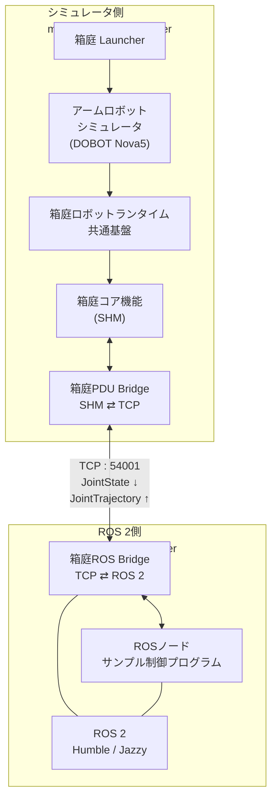

# hakoniwa-robot-arm

`hakoniwa-robot-arm` は、URDF / Xacro で記述されたROSロボットモデルをもとに、箱庭上でロボットアームシミュレータを構築・実行するためのシミュレーション開発基盤です。

ロボットモデルをMuJoCo形式へ変換し、[箱庭ロボットランタイム](https://github.com/hakoniwalab/hakoniwa-robot-runtime)と組み合わせることで、実機を使用せずに関節制御や状態取得を行えます。また、ROS 2からの `JointTrajectory` による制御と `JointState` の取得にも対応しています。

現在のサポート状況：

- DOBOT Nova5

## できること

- URDF / Xacroで記述されたロボットモデルをMuJoCo形式へ変換
- MuJoCoによるロボットアームの物理シミュレーション
- 箱庭ロボットランタイムによる関節制御
- ROS 2 `JointTrajectory` による関節軌道制御
- ROS 2 `JointState` による関節状態の取得
- Dockerを利用したROS 2実行環境
- Host上のMuJoCo Viewerを利用したシミュレーション可視化

## アーキテクチャ

シミュレータ側とROS 2側をTCPで分離し、ROS 2標準メッセージを用いてロボットアームを制御・観測します。

## 動作確認環境

| 項目           | 確認環境                                |
| ------------ | ----------------------------------- |
| Host OS      | macOS（Apple Silicon） / Ubuntu 24.04 |
| ROS 2        | Humble / Jazzy                      |
| MuJoCo       | 3.9.0                               |
| 箱庭側 Python   | 3.12                                |
| Build System | CMake / colcon                      |

HostがmacOSの場合、ROS 2環境をDocker Container上で実行し、Host上の箱庭ロボットアームシミュレータとTCP Bridgeを介して接続します。

## クイックスタート

TODO: リポジトリの取得、依存関係の準備、ロボットモデルのForge、ビルド、シミュレーション起動までの最短手順を記載する。
