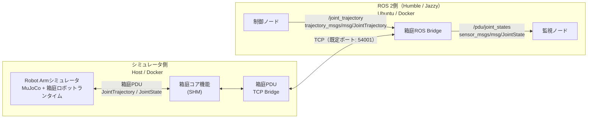
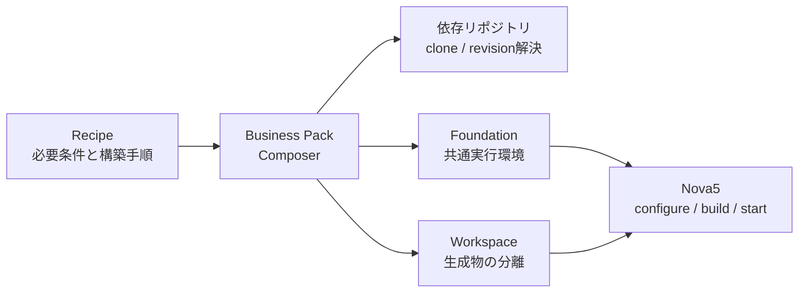

# hakoniwa-robot-arm

`hakoniwa-robot-arm` は、URDF / Xacro で記述されたROSロボットモデルをもとに、箱庭上でロボットアームシミュレータを構築・実行するためのシミュレーション開発基盤です。

ロボットモデルをMuJoCo形式へ変換し、[箱庭ロボットランタイム](https://github.com/hakoniwalab/hakoniwa-robot-runtime)と組み合わせることで、実機を使用せずに関節制御や状態取得を行えます。また、ROS 2からの `JointTrajectory` による制御と `JointState` の取得にも対応しています。

現在の対応状況：

| Robot | 状況 |
| --- | --- |
| DOBOT Nova5 | 移行・host+docker動作確認済み |
| FAIRINO FR5 | ソースとツールを公開。動作確認中。 |
| SO-101 follower | ソースとツールを公開。動作確認中。 |

ロボットの種類毎の設定や実行手順は[対応ロボット](docs/reference/robots.md)を参照してください。

## 初めての方へ

最初に、[クイックスタート](#クイックスタート)の「checkout用workspaceを作る」から開始してください。手動でcloneするのは、同じ親ディレクトリに置く次の2リポジトリだけです。

- `hakoniwa-business-pack` — Composer、Workspace、Foundationを提供します。
- `hakoniwa-robot-arm` — ロボット固有のRecipe、設定、アプリケーションを提供します。

その他の依存リポジトリとRobot Modelは、後続のRecipe操作で必要に応じて取得します。2リポジトリのclone後に、利用する環境に応じてhost-standalone、host-ros2、host+docker、docker-onlyの手順を選んでください。

## ドキュメント

ドキュメントは用途別に分けています。最初は[利用ガイド](docs/README.md)から、利用する環境の手順を選んでください。

- [実行手順](docs/procedures/README.md): setup、build、operation、ROS 2操作
- [設計文書](docs/design/README.md): Recipe、profile、生成物、ROS 2接続
- [参照資料](docs/reference/README.md): 対応ロボット、Model Forge
- [ライセンス情報](docs/license/README.md): 依存OSS、Robot Model、再配布方針

## できること

- URDF / Xacroで記述されたロボットモデルをMuJoCo形式へ変換
- MuJoCoによるロボットアームの物理シミュレーション
- 箱庭ロボットランタイムによる関節制御
- ROS 2 `JointTrajectory` による関節軌道制御
- ROS 2 `JointState` による関節状態の取得
- Dockerを利用したROS 2実行環境
- Host上のMuJoCo Viewerを利用したシミュレーション可視化

## アーキテクチャ

シミュレータ側とROS 2側をTCPで分離し、ROS 2標準メッセージを用いてロボットアームを制御・観測します。ROSトピックはROS 2側で終端し、シミュレータ側では箱庭PDUとして箱庭コアの共有メモリ（SHM）へ入出力します。



### シミュレータの構成

シミュレータ側では、MuJoCoと箱庭ロボットランタイムがロボット定義を読み込み、物理シミュレーション、制御入力の受付、関節状態の出力を行います。箱庭PDU TCP Bridgeは、SHM上の箱庭PDUをROS 2側とのTCP通信へ中継します。MuJoCo Viewerを表示する実行と、Viewerを使用しないheadless実行を選択できます。

### ROS 2側の構成

箱庭ROS Bridgeが、TCP上の箱庭PDUとROS 2標準メッセージを相互変換します。制御には `trajectory_msgs/msg/JointTrajectory`、状態取得には `sensor_msgs/msg/JointState` を使用します。シミュレータとROS 2をTCPで分離しているため、それぞれの実行環境を独立して構築できます。

### 箱庭ロボットランタイム

箱庭ロボットランタイムは、ロボットごとの挙動や通信構成を定義ファイルから組み立てる共通基盤です。主に以下を入力として、物理モデル、制御入力、状態出力、通信経路を構成します。

- 箱庭アセットマニフェスト
- MuJoCoモデル（MJCF）
- PDU定義とPDU通信定義
- アクチュエータ、コントローラ、センサ設定

本リポジトリは各対応ロボット用の設定値と設定ファイルの組み合わせを所有し、各項目の意味、参照関係、検証規則は`hakoniwa-robot-runtime`を正本とします。通常利用ではこれらの設定を変更する必要はありませんが、ロボット構成や制御方法を変更する場合は、次の文書を参照してください。

- [Robot Runtime Configuration](https://github.com/hakoniwalab/hakoniwa-robot-runtime/blob/main/docs/configuration.md): Asset Manifest、Runtime、actuator、controller、state-output、PDU、Endpointの設定仕様と参照関係
- [Robot Runtime Design](https://github.com/hakoniwalab/hakoniwa-robot-runtime/blob/main/docs/design.md): Runtimeの責務、内部構成、Adapterとの境界
- [Runtime-owned JSON Schemas](https://github.com/hakoniwalab/hakoniwa-robot-runtime/tree/main/schemas): Runtimeが所有する機械可読な設定Schema
- [Hakoniwa PDU Endpoint Schemas](https://github.com/hakoniwalab/hakoniwa-pdu-endpoint/tree/main/config/schema): PDU Definition、PDU Types、Endpoint、Cache、Comm形式の正本

具体的な設定例として、Nova5では次のファイルを使用します。FR5／SO-101にも`recipes/<robot>/`以下に同じ構成の設定があります。

| 設定 | Nova5の設定ファイル | 主な役割 |
| --- | --- | --- |
| Asset Manifest | [`recipes/nova5/asset-manifest.json`](recipes/nova5/asset-manifest.json) | モデル、PDU、Endpoint、Runtime componentを束ねる入口 |
| Runtime | [`recipes/nova5/config/runtime.json`](recipes/nova5/config/runtime.json) | actuator Runtimeの共通設定とcommand timeout |
| MuJoCo actuator | [`recipes/nova5/actuator.yaml`](recipes/nova5/actuator.yaml) | position actuatorの`kp`、`dampratio`、`ctrlrange`。ゲイン変更は再Forgeが必須。調整手順は[Model Forge](docs/reference/model-forge.md#4-kpとdampratioの調整)を参照 |
| Actuator / Controller / State Output | [`recipes/nova5/config/`](recipes/nova5/config) | joint binding、軌道制御、関節状態出力 |
| PDU Definition / Types | [`recipes/nova5/config/pdu/`](recipes/nova5/config/pdu) | Nova5が使用するPDU robot、channel、message type |
| Endpoint | [`recipes/nova5/config/endpoint/nova5_endpoint.json`](recipes/nova5/config/endpoint/nova5_endpoint.json) | PDU Definitionと通信backendの選択 |

`nova5.py configure`がwork側へ生成する`launcher.json`や、Forgeが生成するMJCFは直接編集しません。元となるManifest、config、Recipeを変更して再生成します。変更対象ごとのForge／configure／buildの区別、生成先、反映確認は[設定変更と反映方法](docs/design/configuration-workflow.md)を参照してください。

## ライセンスとRobot Model

別途ライセンス表示のある第三者成果物を除き、本リポジトリ自身のソースコード、設定、ツール、文書には、ルートの[Apache License 2.0](LICENSE)が適用されます。利用するHakoniwa OSSと外部OSSには、それぞれのライセンスが適用されます。詳細は[依存コンポーネントのライセンス一覧](docs/license/dependencies.md)を参照してください。

上流のURDF、Xacro、MJCF、mesh、CAD、textureなどのRobot Model本体と、Forgeで生成した派生成果物は、本リポジトリへ同梱・再配布しません。利用者自身が固定revisionから取得し、`$HAKONIWA_WORK_DIR/model-forge/`以下へ生成します。本リポジトリが管理するのは、取得・変換の定義、箱庭固有の設定、およびライセンス調査の記録です。

各モデルの取得元、固定revision、確認したライセンス宣言、再配布上の注意は、[Robot Modelのライセンス情報](docs/license/robot-models.md)を参照してください。この台帳にはNova5、FR5、SO-101の調査結果を掲載しています。本リポジトリのApache License 2.0が、第三者モデルまたはその派生成果物へ自動的に適用されるものではありません。

モデルごとの`source.yaml`と`LICENSE_INFO.yaml`は、次のように責務を分けています。変換・正規化の手順は、対応するForge Recipeとツールで管理します。

| ファイル | 責務 |
| --- | --- |
| `source.yaml` | Forgeが取得する上流repository、固定revision、対象ファイルを指定する取得定義 |
| `LICENSE_INFO.yaml` | 固定revisionで確認したライセンス根拠、未確定事項、再配布の判定と必要な対応を記録する調査台帳 |

これらはモデル本体を含まず、また法的助言ではありません。上流モデルまたはForge生成物を外部へ再配布する前には、対象モデルの台帳と上流のライセンス本文・NOTICE・package metadataを確認してください。

## 箱庭Business Packとの関係

[hakoniwa-business-pack](https://github.com/hakoniwalab/hakoniwa-business-pack)は、箱庭シミュレーションに必要な依存関係、共通実行環境、ビルド手順を管理するComposerです。本リポジトリはロボット固有のモデル、設定、アプリケーションを提供し、環境の構築と分離にはBusiness PackのWorkspace、Foundation、Recipeの仕組みを利用します。



### Workspace

Workspaceは、使用するFoundationと生成物を他の作業環境から分離するための実行環境です。`workspace.py enter --workdir <path>`で専用シェルへ入り、選択したパスが`HAKONIWA_WORK_DIR`に設定されます。Foundation、Forge、Recipeのビルド、設定、ログ、セッションは、このworkディレクトリ以下へ生成されます。

### Foundation

Foundationは、複数のシミュレーションで再利用する箱庭の共通実行環境です。Nova5では、箱庭コア、PDU Endpoint、PDU Bridge、Python API、Launcher、および実行時設定を`HAKONIWA_WORK_DIR/foundation/`以下へ構築します。

### Recipe

Recipeは、「何が必要で、どのrevisionを使い、何を構築・検証するか」を記述したYAMLファイルです。Business Packの`tools/recipe.py`はRecipeを読み、次の処理を行います。

- `plan`: clone、checkout、再利用、Foundationビルドの予定を表示
- `configure`: 依存リポジトリを準備し、必要なFoundationとPython依存を構築
- `doctor`: FoundationとRecipe依存が実行可能な状態か検査

本リポジトリの`tools/recipe/<robot>.py`は、その環境を利用して各ロボット固有のForge、configure、build、start、stopを実行します。対応するentrypointと置換方法は[対応ロボット](docs/reference/robots.md)を参照してください。

## 動作確認環境

| 項目           | 確認環境                                |
| ------------ | ----------------------------------- |
| Host OS      | macOS（Apple Silicon） / Ubuntu 24.04 |
| ROS 2        | Humble / Jazzy                      |
| MuJoCo       | 3.9.0                               |
| 箱庭側 Python   | 3.12                                |
| Build System | CMake / colcon                      |

HostがmacOSの場合、ROS 2環境をDocker Container上で実行し、Host上の箱庭ロボットアームシミュレータとTCP Bridgeを介して接続します。

## 前提ソフトウェア

選択する利用構成に応じて、Hostへ以下をインストールしてください。

| ソフトウェア | 用途 |
| --- | --- |
| Git | すべての構成で、本リポジトリとBusiness Packを取得するために使用 |
| CPython 3.12 | host-standalone／host-ros2／host+dockerで、Business Pack、Foundation、Recipeツールを実行。`python3.12`コマンドで起動できること |
| CMakeとC/C++ビルド環境 | host-standalone／host-ros2／host+dockerで、FoundationとNova5シミュレータをビルド |
| Docker | host+dockerまたはdocker-only構成でのROS 2実行 |

macOSではXcode Command Line Tools、UbuntuではC/C++コンパイラを含む標準的なビルド環境も必要です。

すべての構成でGitを確認します。

```bash
git --version
```

host-standalone、host-ros2、host+dockerのいずれかを選ぶ場合は、Host側のPythonとビルド環境も確認します。

```bash
python3.12 --version
cmake --version
```

host+dockerまたはdocker-onlyを選ぶ場合は、追加でDockerを確認します。

```bash
docker --version
```

## 利用構成

### host-standalone

箱庭RuntimeとMuJoCo ViewerをHost上で実行し、ROS 2を介さずに箱庭PDUレベルの動作確認を行います。

### host-ros2

箱庭Runtime、MuJoCo Viewer、ROS 2 Bridge、ROSノードを同じUbuntu Host上で実行し、`JointTrajectory`による制御と`JointState`の取得を確認します。

### host+docker

Host上でシミュレータ、Docker Container上でROS 2 BridgeとROSノードを実行します。macOSでROS 2を利用する場合の基本構成です。HostとDockerの生成物は、それぞれ `HAKONIWA_WORK_DIR` と `HAKONIWA_ROS2_WS` で分離します。

### docker-only

シミュレータとROS 2を同一のLinux Container内で実行します。HostへPython、CMake、ROS 2などの開発環境を導入せずに動作確認したい場合に適しています。ネイティブUbuntuでも同じContainer内手順を利用でき、macOS上のDockerではheadless実行を使用します。

## クイックスタート

### 共通：checkout用workspaceを作る

空のディレクトリを作り、その直下へBusiness Packと本リポジトリをcloneします。本リポジトリはprivate repositoryであるため、アクセス権を持つGitHubアカウントまたは認証情報が必要です。

```bash
# 利用者が置きたい親ディレクトリで実行する。
mkdir -p hakoniwa-robot-arm-workspace
cd hakoniwa-robot-arm-workspace
git clone https://github.com/hakoniwalab/hakoniwa-business-pack.git
git clone https://github.com/teras-project/hakoniwa-robot-arm.git
```

この時点では2リポジトリだけで構いません。標準配置では、後続のprofileがこの兄弟配置を自動検出します。Nova5が必要とする他のリポジトリは、Recipeの`configure`またはROS 2 workspaceの`build`が自動取得します。

### 箱庭単体で確認するユーザー：host-standalone

1. [箱庭単体セットアップ](docs/procedures/host-standalone/setup.md)
2. [箱庭単体ビルド](docs/procedures/host-standalone/build.md)
3. [箱庭単体の起動・動作確認](docs/procedures/host-standalone/operation.md)

### Ubuntu HostだけでROS 2連携するユーザー：host-ros2

1. [Host ROS 2連携セットアップ](docs/procedures/host-ros2/setup.md)
2. [Host ROS 2連携ビルド](docs/procedures/host-ros2/build.md)
3. [Host ROS 2連携の起動・動作確認](docs/procedures/host-ros2/operation.md)

### macOSユーザー：host+docker

macOSでは、Nova5 RuntimeとMuJoCo ViewerをHost、ROS 2 BridgeとROSノードをDocker Containerで実行します。HostとDockerはTCPで接続します。

1. [host+dockerセットアップ](docs/procedures/host-docker/setup.md)
2. [host+dockerビルド](docs/procedures/host-docker/build.md)
3. [host+docker起動・動作確認](docs/procedures/host-docker/operation.md)

人が操作する場合はHost上のMuJoCo Viewerを利用できます。CIや画面のない自動確認ではheadlessを選択します。

### Host環境を汚さず試したいユーザー：docker-only

HostへCPython 3.12、CMake、ROS 2などを導入せず、GitとDockerだけで動作確認したい場合はdocker-onlyを選択します。Nova5とROS 2を同じ1つのUbuntu Container内で実行します。

1. [docker-onlyセットアップ](docs/procedures/docker-only/setup.md)
2. [docker-onlyビルド](docs/procedures/docker-only/build.md)
3. [docker-only起動・動作確認](docs/procedures/docker-only/operation.md)

native Linux HostではViewerを利用できます。macOS Docker Desktopではnative architectureのheadless実行を使用します。

## リポジトリ構成

| パス | 責務 |
| --- | --- |
| `apps/` | 共通ランタイムを利用するアームシミュレータのアプリケーション |
| `recipes/nova5/` | Nova5のManifest、PDU、制御、Forge設定 |
| `recipes/ros2/` | ROS 2 TCP BridgeのRecipe |
| `ros2_packages/` | 標準colconでbuildするROS 2サンプルノード |
| `sources/models/` | 上流モデルの取得情報、出典、work内での正規化手順。取得したモデル本体は含まない |
| `tools/` | Forge、Recipe操作、環境生成、制御用ツール |
| `docker/` | ROS 2 Humble/Jazzy用のContainer環境 |
| `docs/procedures/` | 利用者が順番どおり実行する環境別手順 |
| `docs/design/` | Recipe、profile、生成物、接続関係の設計説明 |
| `docs/reference/` | 対応ロボットとModel Forgeの参照情報 |
| `docs/license/` | 依存OSSとRobot Modelのライセンス台帳 |

Forgeで取得・生成したモデルはソースツリーへ配置せず、`HAKONIWA_WORK_DIR/model-forge/`以下で管理します。ROS 2のvenv、build、install、logは`HAKONIWA_ROS2_WS`以下へ生成します。

## 必要なリポジトリ

リポジトリは原則として同じ親ディレクトリへ配置します。最初に手動でcloneするのはBusiness Packと本リポジトリだけです。

| リポジトリ | 準備方法 | 用途 |
| --- | --- | --- |
| `hakoniwa-business-pack` | 利用者がclone | Composer、Workspace、Foundation |
| `hakoniwa-robot-arm` | 利用者がclone | 本リポジトリ |
| `hakoniwa-core-pro` | runtime Recipeの`configure`が自動取得 | 箱庭コアとSHM |
| `hakoniwa-pdu-endpoint` | runtime RecipeおよびROS 2 workspaceが自動取得 | PDU通信Endpoint |
| `hakoniwa-pdu-bridge-core` | runtime Recipeの`configure`が自動取得 | Host側TCP Bridge |
| `hakoniwa-pdu-python` | runtime Recipeの`configure`が自動取得 | Python LauncherとPDU API |
| `hakoniwa-robot-runtime` | runtime Recipeの`configure`が自動取得 | 共通ロボットランタイム |
| `hakoniwa-mujoco-robots` | runtime／Forge Recipeの`configure`が自動取得 | MuJoCo共通機能 |
| `hakoniwa-mbody-registry` | Forge Recipeの`configure`が自動取得 | モデル取得・変換ツール |
| `hakoniwa-pdu-ros` | ROS 2 workspaceの`build`が自動取得 | ROS 2 Bridgeパッケージ |

自動取得されるリポジトリとrevisionはRecipeに記録されています。実行前に`tools/recipe.py plan`を使うと、clone、checkout、再利用、Foundationのビルド予定を確認できます。

```text
hakoniwa-robot-arm-workspace/
├── hakoniwa-business-pack/       # 手動clone
├── hakoniwa-robot-arm/           # 手動clone
├── hakoniwa-core-pro/            # configureが自動取得
├── hakoniwa-pdu-endpoint/        # configure/buildが自動取得
├── hakoniwa-pdu-bridge-core/     # configureが自動取得
├── hakoniwa-pdu-python/          # configureが自動取得
├── hakoniwa-robot-runtime/       # configureが自動取得
├── hakoniwa-mujoco-robots/       # configureが自動取得
├── hakoniwa-mbody-registry/      # configureが自動取得
├── hakoniwa-pdu-ros/             # ROS 2 buildが自動取得
├── work-host-nova5/              # Host生成物
└── ros2-work-jazzy/              # ROS 2生成物
```

主な生成先の指定は次のとおりです。

| 環境変数 | 用途 |
| --- | --- |
| `HAKONIWA_COMPOSER` | Composerリポジトリのルート。標準配置では自動検出されるため設定不要 |
| `HAKONIWA_WORK_DIR` | Foundation、Forge、Recipeの生成物。`workspace.py enter --workdir`が選択値を設定 |
| `HAKONIWA_ROS2_WS` | ROS 2のvenv、build、install、log。`docker/run.bash`がディストリビューション別の既定値を設定 |
| `HAKONIWA_ROS2_TCP_CONFIG` | Hostで生成したROS 2 TCP設定をDockerへ渡すHost側パス。`docker/run.bash`の前に利用者が設定 |

## 詳細情報

- [環境別の詳細利用ガイド](docs/README.md)
- [Nova5実行Recipe](recipes/nova5/nova5-joint-trajectory-control.yaml)
- [Nova5モデルForge Recipe](recipes/nova5/nova5-model-forge.yaml)
- [Robot Modelのライセンス情報（Nova5／FR5／SO-101）](docs/license/robot-models.md)
- [ROS 2 Bridge Recipe](recipes/ros2/arm-ros2-topic-bridge.yaml)
- [Docker実行設定](docker/env.bash)

## ライセンスとモデル出典

本リポジトリのソースコードは[Apache License 2.0](LICENSE)で提供します。

本リポジトリで扱うRobot Modelおよびその派生成果物については、各上流プロジェクトのライセンスおよび利用条件を確認する必要があります。
モデル本体やForgeで生成した成果物を、本リポジトリから再配布するものではありません。

モデル別の調査結果、利用上の注意、再配布判定は[Robot Modelのライセンス情報](docs/license/robot-models.md)を確認してください。
